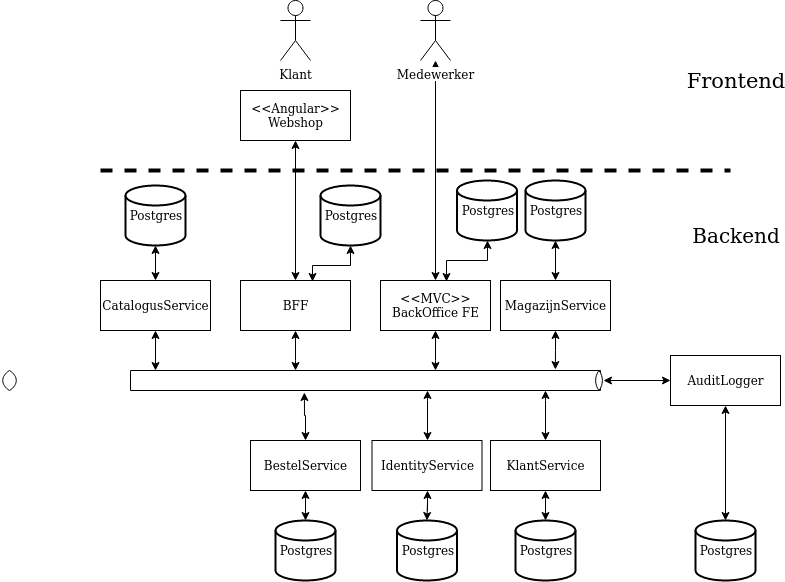

# Kantilever (Macedonieje)

Case 3 implementation of the Kantilever system, created by team Macedonieje.

The application can be found running over at [macedonieje.maartenprojecten.nl](http://macedonieje.maartenprojecten.nl)

## Prerequisites

To run this application locally you'll need Docker, it's also advisable
to have Make installed in order to use the makefile.

If you wish to develop the application, you'll need to have
the .NET core 3.0 SDK installed.

## Getting started

We recommend using Make and/or a Linux OS 🐧 for an easier experience developing the system.

### For Linux/MacOS OR Windows with Make and Git Bash (strongly recommended!) 🐧
1. Clone the git repository
1. Edit your `/etc/hosts` file and add: `127.0.0.1       identity`
1. Run `make prod.up`
1. Visit [localhost:3000](http://localhost:3000) and [localhost:4000](http://localhost:4000)

### For windows
1. Clone the git repository
1. Edit your `c:\windows\system32\drivers\etc\hosts` file and add: `127.0.0.1       identity`
1. Publish the individual services in the ./src folder
1. Run `docker-compose -f src/docker-compose.yaml -f src/docker-compose.prod.yaml -p macedonieje up -d`
1. Visit [localhost:3000](http://localhost:3000) and [localhost:4000](http://localhost:4000)

### Development mode

If you want to run the application in development mode, swap `make prod.up` with `make build-and-start` (`make bs` for short).

### Hosts file

Connecting to identity in the BackOfficeFrontend from the docker-compose container requires us to use the url `http://identity`, but
this has as a consequence that this also becomes the redirect URL that the user in the browser is sent to. Due to this limitation
we're forced to implement this workaround in our development environment using the hosts file.

This has been discussed with Marco Pil and we came to the conclusion that this is a genuine issue and it will
not affect the 'Installation' score on our final report. This can be verified by mr. Pil.

## Architecture

Our system consists of 6 main components, we'll discuss
these components first before we explain the complete picture.

### FrontendService

This service contains both the Angular Frontend and the Backend-For-Frontend (BFF) applications that
run together in a docker container. We've considered separating the two components in an Angular SPA container and
a BFF service. However, taking in mind that getting environment variables into the Angular application isn't an easy task
and that an out-of-the-box project template for combining the SPA and the BFF is already available, we've decided to
_keep it simple (stupid!)_ and take the out-of-the-box solution. Not only is time a priority, but we might also introduce
bugs into the system with custom solutions etc.

The environment variables in the angular application are passed on by the BFF's ASP.NET Core application via a special get method at the moment of initialization. This is setup like this so we can easily set all of the environment variables for Angular in the same way as we set them for the BFF application.

We've chosen to use Angular as it puts less load on the server, all pages are rendered
in the user's browser and only a few JSON API calls are needed to set up the webshop for
any potential klanten. Besides this argument, an SPA is also a lot quicker when it comes
to perceived performance for the user, since there is no networking involved when loading different pages. 

The downside of the choice to use Angular however is that maintaining a separate front- and backend is more work than if it had been a monolithic ASP.NET core application. We do believe that the benefits of an SPA outweigh the maintenance costs.

This decision will not affect scaling too much, since the frontend service is stateless and the BFF and SPA are tightly-coupled
enough to scale together.

This service primarily acts as the gateway to the system for the rest of the world, it's main purpose is to send commands
towards backend services that cause bursts of events to scatter throughout the system. This service contains a cache of the
entire catalogus and voorraad and listens for events to update this cache accordingly. Aside from that, it also saves
bestellingen en klanten to quickly be able to serve HTTP requests from klanten using the frontend.

### BestelService

The bestelservice is the service that is concerned about incoming bestellingen and listens to the bus for all bestel
commands on the bus. This service is the only service we decided to set up using DDD and the Onion/Clean Architecture.

Our reasoning for this is based on the fact that the bestelling entities seem be involved with quite a lot of
business rules that need to be addressed while handling commands, so it's easier to handle all this logic in the
domain rather than in a service, listener or agent.

### KlantService

Arguably the simplest service in the system, used to store klanten in.

## BackOfficeFrontend

The backoffice service that is used to perform a variety of administrative actions
within the system, such as bestellingen klaarmelden, bestellingen keuren, process betalingen
etc.

This frontend is quite similar in function to the frontend for the klanten as it sends commands to backend services which trigger a multitude of events that other services can consume.
One big difference is, that the backoffice is only meant for Kantilever employees and that most routes are locked away behind policies and authorization guards.

Contrary to the webshop however, we've chosen to use ASP.NET Core in the backoffice instead of Angular. For one the backoffice will only be used by a handful of people, thus there is no need to squeeze performance out of the backend to a degree that is equal to the frontend. In light of this, burdening the backoffice frontend's server with rendering does not seem as a terrible decision.

Besides this, we also cut down on maintenance costs by choosing a monolithic frontend rather than an SPA, since it's much easier to make changes without having to worry about breaking something on the other 'end'.

In hindsight, the only real issues we faced by choosing this approach was adding a step in the installation process of editing the hostfile of the developer. 

### IdentityService

This service is concerned with user accounts and listens for AMQP commands on the bus. It was generated using a template
for Identity Service and modified to our needs to contain Miffy, seed data and a JSON importer for configuration.

### RabbitMQ Broker

The most important part of the architecture is the RabbitMQ Broker that connects
all the services. We use one single exchange for all communication, excluding a replay exchange.

### Existing components

The existing services were integrated quite easily using a pre-existing docker-compose file. These services run alongside
the 'new' services and communicate through HTTP requests and the event bus.

## Specifications

We've put together both mockups and Feature files to define our specifications. Mockups can be found in the common/Documentatie_en_Planning/mockups folder.
Specifications can be found in the .Spec projects of most services.

## Considerations

During the course of the project we've made a wild range of decisions and considerations, some of these
considerations can be found in the OPERATIONS.md and DEVELOPMENT.md files.
